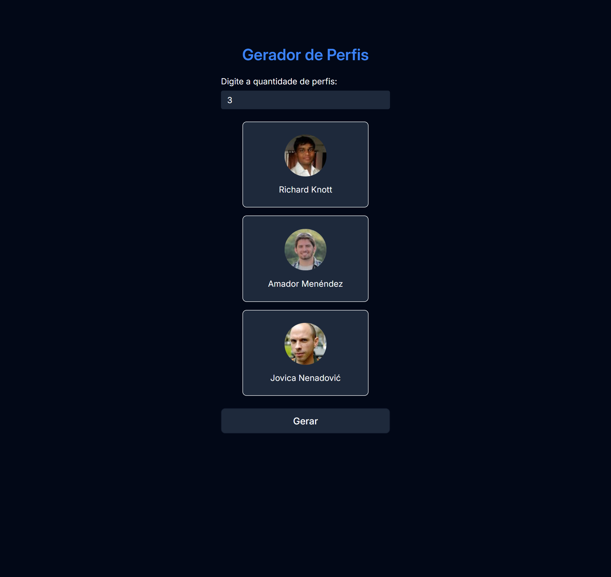

<h1 align="center">
  🧑 Gerador de Perfis
</h1>

<ul>
  <li>
    <a href="#sobre-o-projeto">
      ❓ Sobre o projeto
    </a>
  </li>
  <li>
    <a href="#tecnologias">
      🛠️ Tecnologias
    </a>
  </li>
  <li>
    <a href="#pre-requisitos">
      💻 Pré-requisitos
    </a>
  </li>
  <li>
    <a href="#como-instalar-o-projeto">
      🚀 Como instalar o projeto
    </a>
  </li>
  <li>
    <a href="#como-executar-o-projeto">
      🍷 Como executar o projeto
    </a>
  </li>
  <li>
    <a href="#demonstração-da-aplicação">
      🌐 Demonstração da aplicação
    </a>
  </li>
  <li>
    <a href="#autor">
      🧑 Autor
    </a>
  </li>
</ul>

<p align="center">
  
</p>

## ❓ Sobre o projeto

A atividade da unidade 2 da disciplina de Desenvolvimento Web II do curso Técnico em Informática para Internet do IFCE, tinha como objetivo desenvolver um Gerador de Perfis utilizando HTML, CSS, JavaScript para consumir (chamar/utilizar) a API da Random User, para criar uma lista de perfis falso contendo a informação da foto de perfil do usuário e seu nome.

## 🛠️ Tecnologias

O projeto foi desenvolvido com as seguintes tecnologias:

- [HTML](https://developer.mozilla.org/pt-BR/docs/Web/HTML)
- [CSS](https://developer.mozilla.org/pt-BR/docs/Web/CSS)
- [JavaScript](https://developer.mozilla.org/pt-BR/docs/Web/JavaScript)

## 💻 Pré-requisitos

Verifique aos seguintes pré-requisitos para poder instalar e executar o projeto:

1. Ter instalado um editor de código:
   - [VS Code](https://code.visualstudio.com/download)
   - [Sublime Text](https://www.sublimetext.com/download)
   - [Notepad++](https://notepad-plus-plus.org/downloads)
2. Ter instalado o [Git](https://git-scm.com/downloads)
3. Ter instalado a extensão [Live Server](https://marketplace.visualstudio.com/items?itemName=ritwickdey.LiveServer)

## 🚀 Como instalar o projeto

Siga o passo a passo para instalar o projeto:

1. Abra o terminal e clone o repositório do projeto:

```bash
git clone https://github.com/pedroeuzebiojs/dw2-tii-ifce
```

## 🍷 Como executar o projeto

Siga o passo a passo para executar o projeto:

1. Entre na pasta do projeto clonado:

```bash
cd dw2-tii-ifce
```

2. Abra a pasta do projeto clonado no editor de código de sua preferência. Caso seja o VS Code digite o comando:

```bash
code .
```

3. Entre na pasta `unidade-2` e em seguida a pasta `atividade` e abra o arquivo `index.html` com a extensão Live Server do VS Code

## 🌐 Demonstração da aplicação

- [Exibir projeto](https://pedroeuzebiojs.github.io/dw2-tii-ifce/unidade-2/atividade/index.html)

## 🧑 Autor

<table>
  <tr>
    <td align="center">
      <a href="https://github.com/pedroeuzebiojs">
        
      </a>
      <br />
      Pedro Euzebio
    </td>
  </tr>
</table>
